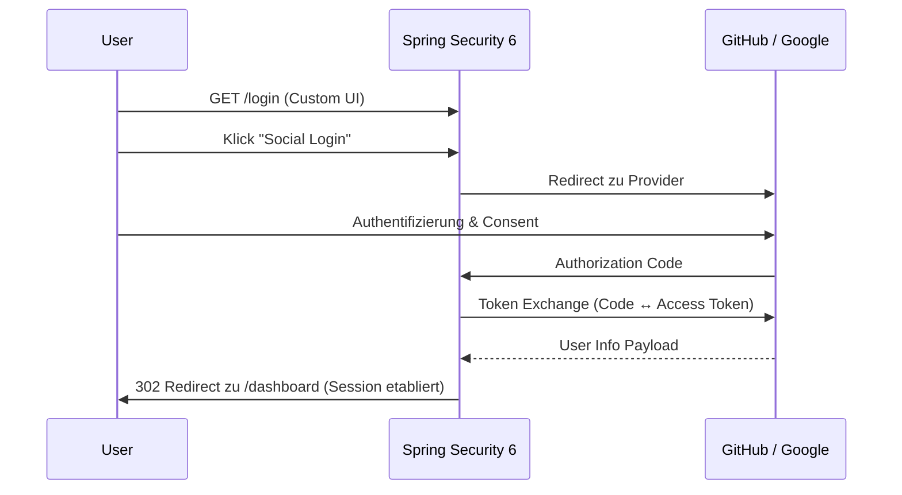

# 🔐 OAuth2 Social Login

[](https://adoptium.net)
[](https://spring.io)
[](https://oauth.net)
[](LICENSE)


Schlanke **Spring Boot 3.3** Referenz-Implementierung für **OAuth2 Social Login** (GitHub & Google) mit sicherem Session-Management, maßgeschneiderter Login-Page und 100% Testabdeckung.

---

## ⚡ Quick Start

### 1. Secrets konfigurieren
Erstelle eine `src/main/resources/application-local.yml` (wird via `.gitignore` ignoriert):

```yaml
spring:
  security:
    oauth2:
      client:
        registration:
          github:
            client-id: DEINE_GITHUB_ID
            client-secret: DEIN_GITHUB_SECRET
          google:
            client-id: DEINE_GOOGLE_ID
            client-secret: DEIN_GOOGLE_SECRET
```

### 2. App starten
```bash
# Lokal mit dem Profil 'local' starten
./mvnw spring-boot:run -Dspring-boot.run.profiles=local
```
Öffne anschließend [http://localhost:8080](http://localhost:8080).

---

## 📊 Architektur & Ablauf



---

## 📁 Projektstruktur

```text
📂 social-login
 ├── 📂 src/main/java/.../oauth2
 │    ├── 📂 controller       # Auth-, Login- & Dashboard-Endpoints
 │    └── 📂 security         # SecurityConfig (OAuth2-Chain)
 ├── 📂 src/main/resources
 │    ├── 📂 templates        # login.html, dashboard.html, error.html
 │    ├── application.yml     # Basis-Konfiguration (Platzhalter)
 │    └── application-local.yml # Lokale Secrets (Ignoriert)
 └── 📂 src/test/java         # Integrationstests (MockMvc)
```

---

## 🔒 Sicherheit

### Security-Header & Session-Schutz
* **CSRF & Session-Fixierung:** Voller Schutz über Spring Security Defaults konfiguriert.
* **Secret-Management:** Echte Credentials liegen ausschließlich in der `application-local.yml` und sind via `.gitignore` geschützt.

| Header | Wert | Schutz vor |
| :--- | :--- | :--- |
| `X-Frame-Options` | `DENY` | Clickjacking |
| `X-XSS-Protection` | `1; mode=block` | Cross-Site-Scripting |
| `Content-Security-Policy` | `script-src 'self'` | XSS & Code-Injection |

---

## 🧪 Tests

### Test-Szenarien (MockMvc)

| Status | Endpunkt | Kontext / Zustand | Erwartetes Ergebnis |
| :--- | :--- | :--- | :--- |
| ✅ PASSED | `GET /login` | Anonym | `200 OK` (Login-Seite) |
| ✅ PASSED | `GET /login?error=true` | Fehlgeschlagener Login | `200 OK` (Fehlermeldung) |
| ✅ PASSED | `GET /login?logout=true` | Nach Abmeldung | `200 OK` (Logout-Bestätigung) |
| ✅ PASSED | `GET /api/v1/demo` | Authentifiziert | `200 OK` (Protected API) |
| ✅ PASSED | `GET /api/v1/demo` | Anonym | `302 Redirect` zu `/login` |

### Integrationstests ausführen
```bash
./mvnw test -Dspring-boot.run.profiles=test
```

---

## 📄 Lizenz
Dieses Projekt ist unter der MIT-Lizenz lizenziert.
